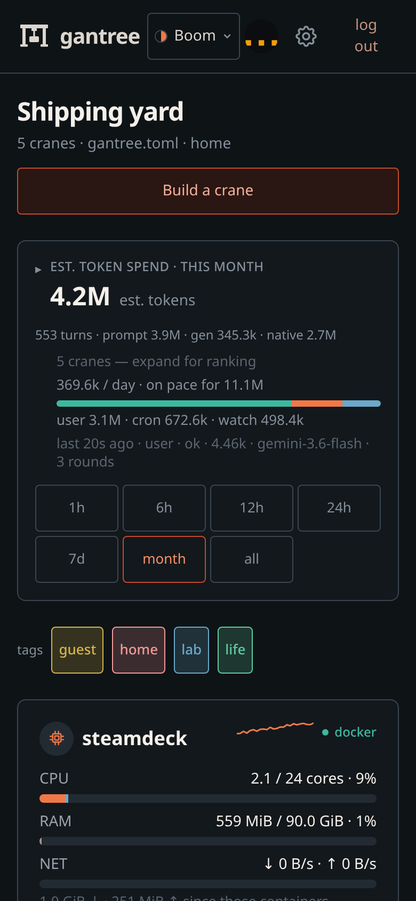
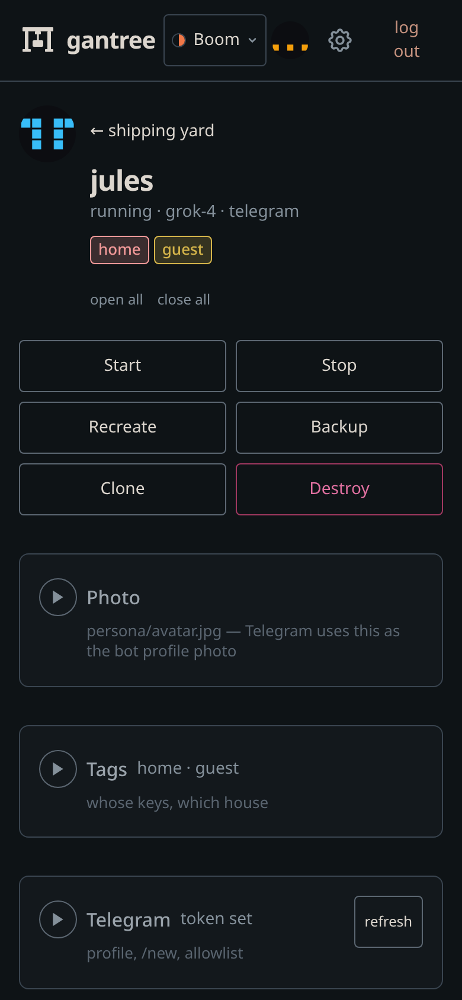
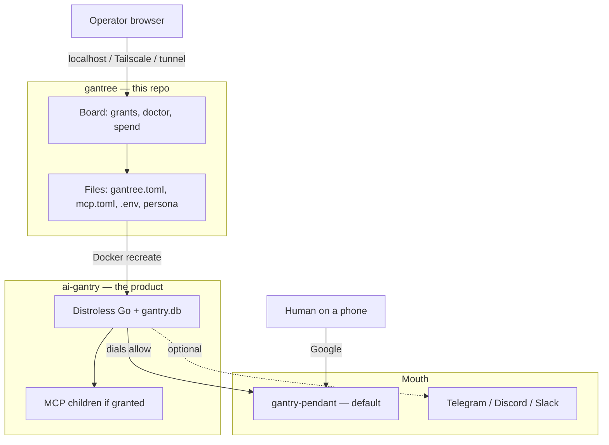
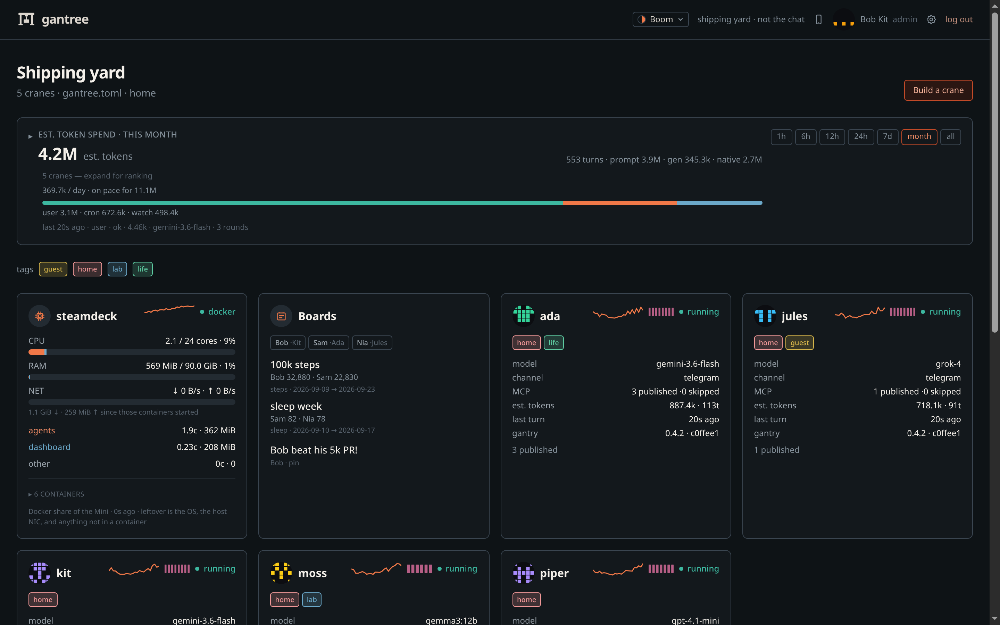
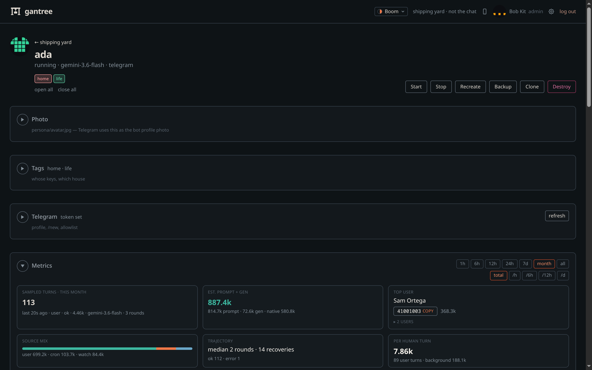

#  gantree

<p align="center">
  
</p>

<p align="center">
  <a href="https://github.com/shotah/gantree/actions/workflows/ci.yml"></a>
  <a href="https://github.com/shotah/gantree/actions/workflows/ci.yml"></a>
  <a href="https://github.com/shotah/gantree"></a>
  <a href="https://hub.docker.com/r/shotah/gantree"></a>
  <a href="https://shotah.github.io/gantree/"></a>
  <a href="LICENSE"></a>
</p>

> **gantry** *(n.)* — the rigid frame that holds and positions tools. The
> frame does nothing by itself; the tools and the memory do the work.
>
> **gantree** *(n.)* — the shipping yard those cranes live in.

You opened the yard. **The product is a long-horizon AI harness** you
run — **[ai-gantry](https://github.com/shotah/ai-gantry)**. This repo is
the board that appears when you run more than one. Chat is the
**[pendant](https://github.com/shotah/gantry-pendant)** — the phone mouth
we own. Telegram, Discord, and Slack still work. The UI never sits in a
chat turn.

Site: **[shotah.github.io/gantree](https://shotah.github.io/gantree/)**.

<p align="center">
  
  &nbsp;
  
  &nbsp;
  
</p>

---

## Three repos, one household

The industry name is **AI harness**. The goal is **long-horizon
planning**: hold aims, personality, and work across days — not a chatbot
that dies when the context window gets expensive.

Most “personal agents” are a chatbot with a plugin list. They feel like
someone after a long thread, then `/new` lobotomizes them. A small local
model misspells a tool name and the chain dies. A dashboard or a gateway
sits in the token path, so every message pays a platform tax.

This household is three GitHub repos. They share a **file and env
contract**. They do not share a database.



| Repo | Job | Does not |
| --- | --- | --- |
| **[gantree](https://github.com/shotah/gantree)** | Operate named cranes. Write files. Pull Docker. Push pendant Worker secrets from Settings. | Sit in a chat turn. Be an IdP. |
| **[ai-gantry](https://github.com/shotah/ai-gantry)** | Be the person. Completer, memory, tools. Dial out. | Learn the yard exists. Open a port. |
| **[gantry-pendant](https://github.com/shotah/gantry-pendant)** | Default phone mouth. Google door. One Durable Object room per crane. | See the yard cookie. Keep a second human roster. |

The crane’s `.env` is the one human allowlist. Gantree writes it. The
crane reads it at boot. The Worker enforces the `allow` frame the crane
published. Yank a person = edit `.env` + recreate. Details:
[access.md](docs/access.md).

MCP tools (maps, Garmin, boards, image, …) are **grants**, not peer
products. Listed in that crane’s `mcp.toml` is the grant. Omit it and it
does not exist. Catalog and a custom binary:
[custom-mcp.md](docs/custom-mcp.md).

```text
static binary + persona + mcp.toml + any OpenAI-compat LLM  →  outbound chat
```

Nothing on the crane listens. Health is an exit code, not a port. **No
open ports. Ever.**

Want a bot tonight? Stay here. Deploy
[gantry-pendant](https://github.com/shotah/gantry-pendant) once (that
repo’s CI). On this board: Settings → Pendant, then **build a crane** —
default channel is pendant. This yard pulls `shotah/ai-gantry`, writes
the files, recreates. You do not need the other checkout to stand a crane
up. Telegram is still a mouth if you already have a bot.

---

## Why the harness holds

**[ai-gantry](https://github.com/shotah/ai-gantry)** spends the
engineering budget on the thing you actually talk to. One Distroless
Go process. One persona. One OpenAI-compat model — Ollama, Gemini,
ChatGPT, Grok. Chat dials *out*. Tools if you grant them. Memory you can
`sqlite3`. Aims that still exist on Thursday.

The thing the human feels is a **trajectory that completes.** Independent
lookups fan out in one round; the next round uses the results. Pull
Garmin metrics, write them to a spreadsheet, update Strava — one
conversation, not three broken chats. Pull contacts, check shared
calendars for a hole, create the event with those people on it. Parallel
tool calls, then multi-step, and *many* turns that actually finish. The
Gemini *app* cannot even do that. We run it on **Gemini Flash** through
GCP. Same family of model; this loop is the difference.

The loop itself was hardened on **Gemma 12B** (and the 7–12B class):
typos, printed JSON, think-stalls. Quality was there. On a memory-bound
Mini it was too slow to live with — that is RAM and prefill, not a
missing repair. Point the harness at Ollama when the box can feed it;
Flash when you want the trajectory now.

This repository is the board that appears when you run more than one of
those. It is a by-product. If a chart would make the harness slower, the
chart is wrong.

| You get | Why it holds |
| --- | --- |
| The same person next week | `SELF.md` + inspectable SQLite. `/new` distills; it does not wipe who they are. |
| Many turns that finish | Mid-chain does not die. Garmin → sheet → Strava is one thread. |
| Parallel, then chain | Fan out what is independent (contacts *and* free/busy). Sequence what is not (then create the event). |
| Aims that outlive the chat | Cron, quiet watches, a spark of life — the Completer only runs when something actually changed. |
| A box you can own | Distroless, outbound-only, env + mounts. MCP listed in `mcp.toml` is the grant. |

Want another brain? Another process. Not another tab. Chat, memory, and
cron work with **zero** tools. The frame hosts binaries; it does not
become a zoo.

The internals —
[design](https://github.com/shotah/ai-gantry/blob/main/docs/design.md) ·
[features](https://github.com/shotah/ai-gantry/blob/main/docs/features.md) ·
[mcp](https://github.com/shotah/ai-gantry/blob/main/docs/mcp.md).

---

## The board

Gantree is the operator plane: cards, doctor, grants, logs, spend. It
reads Docker and files after the fact. Agents open **zero** inbound
ports. Only this UI is reachable, and only through a path you chose.

<p align="center">
  
</p>

<p align="center">
  
</p>

The yard is allowed to be a bit meh. It is JS, in a browser, for an
operator who clicks a few named pets. The harness is not.

If you need a team inbox, a multi-agent router, or “ChatGPT for work” on
day one, this is the wrong stack — and that’s fine.

Never sit in the token path.

---

## Hello

Docker on the same Linux host. **Node 22.** First boot is **`/setup`**
(one operator). After that, **`/login`**. Default mouth is the pendant.

```bash
git clone https://github.com/shotah/gantree.git
cd gantree
cp gantree.toml.example gantree.toml
npm install
npm run build
npm start                 # http://127.0.0.1:3000
```

Open the board. Settings → Pendant. Build a crane. Grant a tool. Message
it on your phone.

Cranes pin `shotah/ai-gantry:latest`. Nested `repos/ai-gantry` is **dev
only** — do not copy `.env` or `data/` from a private checkout.

No UI, one crane by hand:
**[ai-gantry deploy-docker](https://github.com/shotah/ai-gantry/blob/main/docs/deploy-docker.md)**.

Home Mini vs cloud VM, tunnels, attach existing dirs:
**[docs/install.md](docs/install.md)** ·
**[docs/headless.md](docs/headless.md)**. Grants, doctor, avatars:
**[docs/console.md](docs/console.md)**. Login, profile, settings:
**[docs/operators.md](docs/operators.md)**.

| Path | When |
| --- | --- |
| `npm start` | Console on this host (`127.0.0.1`) |
| `npm run dev` | Same, with hot reload. Loopback auto-login: `GANTREE_DEV` in `.env` ([security](docs/security.md#dev-auto-login)) |
| `npm run seed` | Screenshot yard: 5 operators, 5 named cranes, host + token series, mock corkboard. Pair with `GANTREE_SHOT=1` ([console](docs/console.md#screenshot-yard-no-daemon)) |
| `docker compose up -d` | Hub image `shotah/gantree` on `:80` — never set `GANTREE_DEV` here |
| **[ai-gantry](https://github.com/shotah/ai-gantry)** | Harness only — no yard |
| **[gantry-pendant](https://github.com/shotah/gantry-pendant)** | Phone mouth (default) — Worker only |

```bash
npm run dev               # still 127.0.0.1; GANTREE_DEV auto-login is loopback only
```

Agents open **zero** inbound ports. If you expose this console, you
expose it to yourself.

```text
browser  →  gantree (localhost | Tailscale | compose.cloudflare.yml | compose.nginx.yml)
                                                         gantry  gantry  gantry
phone    →  gantry-pendant (Google)  ←dials—  those same gantries
```

---

## Read next

| If you want… | Go here |
| --- | --- |
| The site | **[shotah.github.io/gantree](https://shotah.github.io/gantree/)** |
| The harness | **[ai-gantry](https://github.com/shotah/ai-gantry)** |
| Harness without this UI | **[deploy-docker](https://github.com/shotah/ai-gantry/blob/main/docs/deploy-docker.md)** |
| The phone mouth | **[gantry-pendant](https://github.com/shotah/gantry-pendant)** |
| The board, grants, avatars | **[docs/console.md](docs/console.md)** |
| Login, profile, settings | **[docs/operators.md](docs/operators.md)** |
| Home Mini vs cloud VM | **[docs/install.md](docs/install.md)** |
| Headless host + attach | **[docs/headless.md](docs/headless.md)** |
| A custom MCP binary | **[docs/custom-mcp.md](docs/custom-mcp.md)** |
| How the yard is put together | **[docs/architecture.md](docs/architecture.md)** |
| The door (login, bind, hardening) | **[docs/security.md](docs/security.md)** |
| Cloudflare protections (Access, rate-limit, bots) | **[docs/protections.md](docs/protections.md)** |
| One person across yard, pendant, crane | **[docs/access.md](docs/access.md)** |
| Move a crane from Telegram to pendant | **[docs/channel_migration_doc.md](docs/channel_migration_doc.md)** |
| Open items | **[docs/todo.md](docs/todo.md)** |

Never sit in the token path.

## License

MIT — see [LICENSE](LICENSE).
