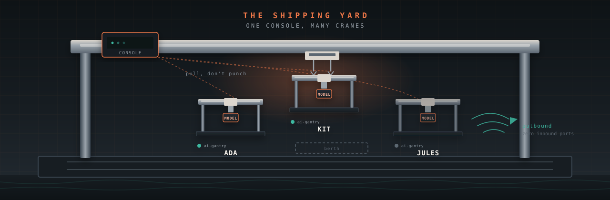

# gantree

<p align="center">
  
</p>

<p align="center">
  <a href="https://github.com/shotah/gantree/actions/workflows/ci.yml"></a>
  <a href="https://github.com/shotah/gantree/actions/workflows/ci.yml"></a>
  <a href="https://github.com/shotah/gantree"></a>
  <a href="LICENSE"></a>
</p>

> **gantree** *(n.)* — the shipping yard. A **gantry** is one crane: one
> process, one persona, one model, one `data/`. The frame does nothing by
> itself; the tools and the memory do the work. The yard is where you
> *operate* those cranes — see them, grant a tool, yank another, recreate,
> read logs — so each one can **plan on a long horizon**.

> Make a yard small enough that an operator can see every crane, careful
> enough that the chat loop never waits on a dashboard, and personal
> enough that you, a partner, and a tryout stay three brains. Long-horizon
> planning lives in the harness. This repo keeps each crane granted, alive,
> and itself.

**Operate your own agents.** Open a board. Build a new crane. Grant Google,
yank Strava, notice a dead token, recreate. Chat stays in Telegram. Nothing
in this UI sits in a chat turn.

```text
browser  →  gantree (localhost | Tailscale | tunnel)  →  Docker + files
                                                         gantry  gantry  gantry
```

The shipping yard for **[ai-gantry](https://github.com/shotah/ai-gantry)**.
The harness is a tight Go loop — parallel tool batches, cheap Completer
rounds, small RSS. **That speed is the product the human feels.** Gantree
reads Docker and files after the fact. It does not get a vote in the tool
loop. Agents open **zero** inbound ports. If you expose the console, you
expose it to yourself.

We spent the engineering budget on the **operator loop** that long-horizon
agents actually need on week two: a named board, a grant that writes
`mcp.toml`, a doctor that says why a tool is skipped, recreate that does
not become SSH folklore at 11pm. Completeness of a platform is not the
goal. Keeping Kit able to plan — with *its* tools and *its* personality —
is.

If you need a team inbox, a multi-agent router, or “ChatGPT for work” on
day one, this is the wrong repo — and that’s fine.

---

## Hello

Docker on the same Linux host.

```bash
git clone https://github.com/shotah/gantree.git
cd gantree
cp gantree.toml.example gantree.toml
npm install
npm run build
npm start                 # http://127.0.0.1:3000
```

Need **Node 22**. Headless host + attach existing agents:
**[docs/headless.md](docs/headless.md)**.

Build a crane from the board (yard type first: home Mini or cloud VM).
Click the card for graphs + logs. Grant a tool, recreate, watch *that*
crane’s doctor. Message it on Telegram. `/tools` is the crane’s mouth;
this page is the operator’s.

Pin: `shotah/ai-gantry:0.1.66` (Hub). Nested `repos/ai-gantry` is **dev
only** — do not copy `.env` or `data/` from a private checkout.

Walkthrough: **[docs/install.md](docs/install.md)**.

### Other ways to run

| Path | When |
| --- | --- |
| `npm start` | Console on this host (`127.0.0.1`) |
| `docker compose up -d --build` | Same console, containerized |
| **[docs/headless.md](docs/headless.md)** | Headless host: Node 22, attach existing dirs, SSH tunnel |
| **[docs/install.md](docs/install.md)** | Home Mini vs your GCE/EC2 (Tailscale / Cloudflare Tunnel — never `0.0.0.0`) |
| **[ai-gantry](https://github.com/shotah/ai-gantry)** | One crane, no yard — `docker compose up` in that repo |

```bash
npm run dev               # still 127.0.0.1
```

---

## Chat stays the crane’s mouth

Ops for the *human* live in Telegram (`/status`, `/tools`, `/auth`).
Gantree is for the person who owns the box: a handful of named pets, not
a Kubernetes dashboard. Click Kit and you get **Kit’s** graphs and
**Kit’s** log — not a mixed fleet dump.

The crane does not grow a `/metrics` port. The yard **pulls** (`docker
inspect`, `docker logs`, sampled stats, JSON slog). Parse what the harness
already emits. Do not tax parallel tool calls so a chart looks nicer.

---

## Grant is how it stays personal

Long-horizon is useless if the container is “healthy” with zero tools and
a dead token. MCP **is** the grant.

Toggle on → write `[[server]]`, fetch the binary, recreate, wait until
`/tools` shows the prefix. Toggle off → omit from the manifest. “Needs
auth” is a button (laptop hop or paste a code from `/auth` in chat).
Hand-editing `mcp.toml` still works; the UI is a structured editor of the
same file, not a second inventory.

Your own binary: **[docs/custom-mcp.md](docs/custom-mcp.md)**.

### Two files, not a catalog

Planning that survives `/new` is still the crane’s job. Most agents *feel*
like someone after a long chat, then the session dies.

| File | Who writes it |
| --- | --- |
| `PERSONA.md` | You — who it should be, who you are |
| `SELF.md` | The agent — voice, rituals, north-star aims that survive `/new` |

Gantree edits those files (and `.env`, and `mcp.toml`). It does not merge
memories across cranes. Isolation is the feature: one human, one bot, one
directory, one `data/`. Delete a tryout = delete that directory.

---

## Read next

| If you want… | Go here |
| --- | --- |
| Home Mini vs cloud VM | **[docs/install.md](docs/install.md)** |
| Headless host + attach existing agents | **[docs/headless.md](docs/headless.md)** |
| A custom MCP binary | **[docs/custom-mcp.md](docs/custom-mcp.md)** |
| How the yard is put together (Vinext, Docker, files) | **[docs/architecture.md](docs/architecture.md)** |
| The crane — loop, memory, long-horizon contract | **[ai-gantry](https://github.com/shotah/ai-gantry)** |
| Walk order | **[todo.md](todo.md)** |

The yard is allowed to be a bit meh. It is JS, in a browser, for an
operator who clicks a few cranes. The crane is not. Never sit in the
token path.

## License

MIT — see [LICENSE](LICENSE).
