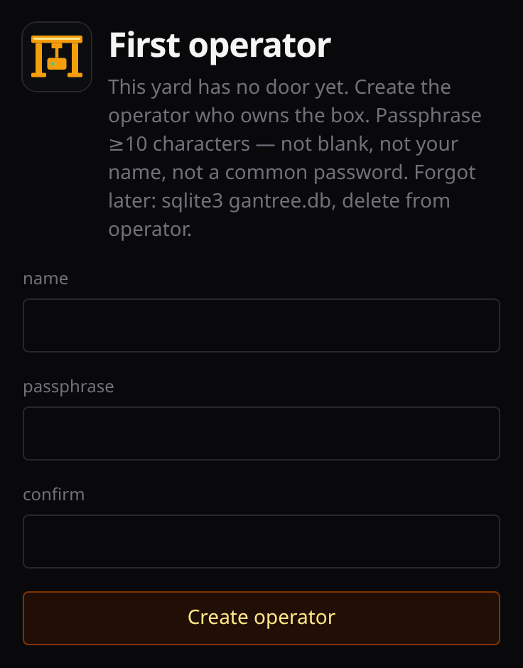
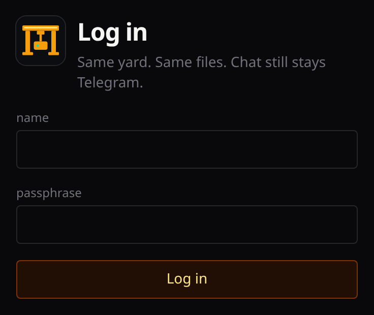
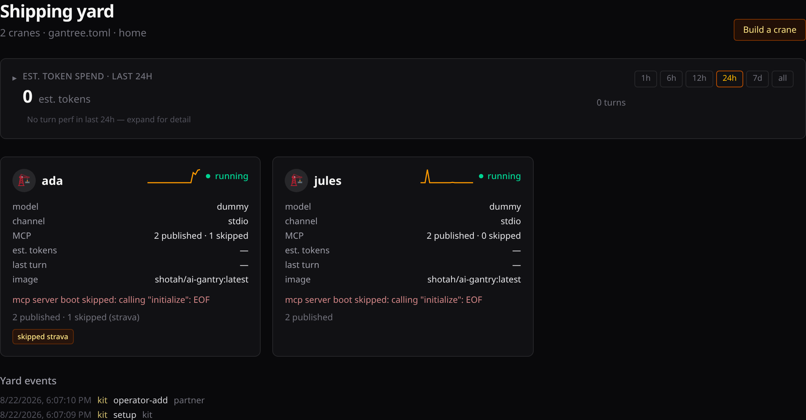
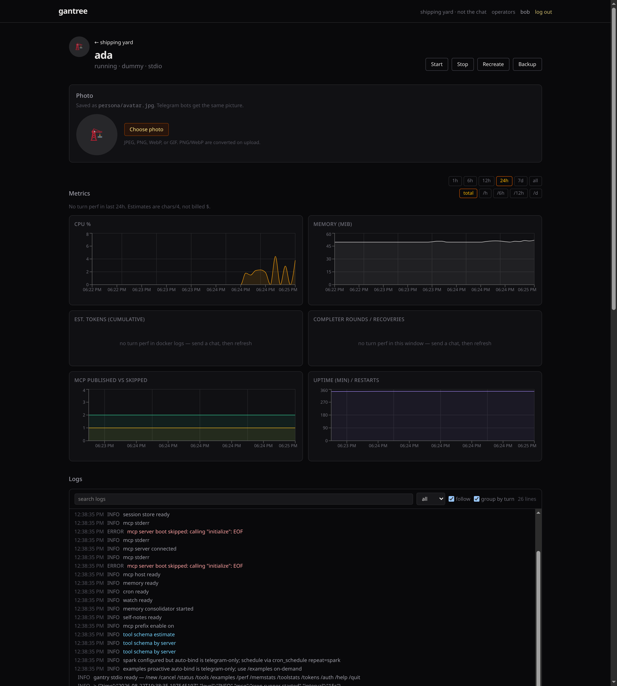
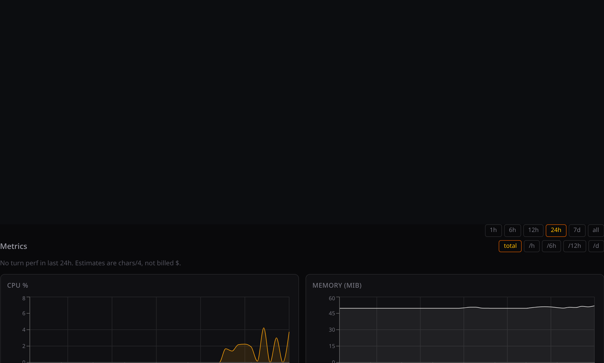
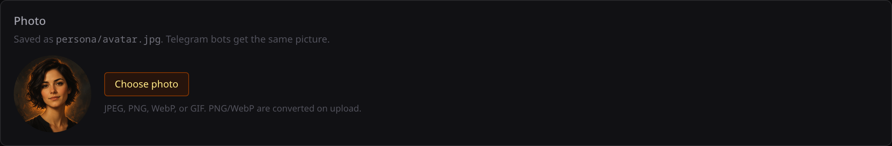

# Console — the yard board

The product is the crane:
**[ai-gantry](https://github.com/shotah/ai-gantry)**. This page is the
operator walk for **this** repo — the board that appears when you run more
than one. Pitch and why the harness is worth operating live in the
[root readme](../README.md). Install: [install.md](install.md). Headless
host + attach: [headless.md](headless.md). Login, profile, settings:
[operators.md](operators.md). Door: [security.md](security.md).

Chat stays Telegram (or Discord / Slack). Nothing here sits in a chat turn.
Gantree reads Docker and files after the fact. It writes the same files the
harness already understands.

```text
browser  →  gantree (localhost | Tailscale | tunnel)  →  Docker + files
                                                         gantry  gantry  gantry
```

Agents open **zero** inbound ports. Bind `127.0.0.1` by default. If you
expose the console, you expose it to yourself.

---

## First boot

Need **Node 22**. `npm start` (or compose) on the Docker host.

1. Open `http://127.0.0.1:3000` — first boot is **`/setup`** (one operator).
2. After that, **`/login`**.
3. Sessions live in yard `gantree.db` — not a crane’s `data/gantry.db`.

Forgot the passphrase: stop, delete that sqlite file, start, run setup
again. No email reset. Click your name for **Profile**; the cog is
**Settings**. Roles, add/remove, and the stuck table:
[operators.md](operators.md). What the door checks:
[security.md](security.md).





---

## Board

A handful of named pets, not a Kubernetes dashboard. Each card: name, alive
or not, model, channel, published vs skipped MCP. **Nags** (dead process,
skipped grant, needs-auth) sit on the card — you do not have to open Tools.
Click through. Kit’s page is **Kit** — graphs and log, not a mixed fleet dump.

Build a crane from the board (yard type first: home Mini or cloud VM).
Telegram: **Create with BotFather** copies `/newbot`, opens the chat, and
suggests `{slug}_bot` — paste the token it replies with. **Upload a photo** on the crane — it lands in `persona/avatar.jpg`, shows on
the board, and if the channel is Telegram the bot’s face updates too. On a
Telegram crane, **Telegram** (below the photo) can `getMe` the token, push
name / about / the `/` command menu, and edit `TELEGRAM_ALLOWED_USERS` from
numeric ids (slog `user_id` after someone talks — not `@username`). Grant
a tool, recreate, watch *that* crane’s doctor. Message it on Telegram.
`/tools` is the crane’s mouth; this page is the operator’s.









Pin: `shotah/ai-gantry:latest` (Hub). Nested `repos/ai-gantry` is **dev
only** — do not copy `.env` or `data/` from a private checkout.

---

## Grant is how it stays personal

Long-horizon is useless if the container is “healthy” with zero tools and a
dead token. MCP **is** the grant. The UI is a structured editor of that
crane’s `mcp.toml`, not a second inventory.

- Toggle on → write `[[server]]`, fetch the binary, recreate, wait until
  `/tools` shows the prefix.
- Toggle off → omit from the manifest.
- “Needs auth” is a button (laptop hop or paste a code from `/auth` in
  chat).

Hand-editing `mcp.toml` still works. Your own binary:
[custom-mcp.md](custom-mcp.md).

### Two files, not a catalog

| File | Who writes it |
| --- | --- |
| `PERSONA.md` | You — who it should be, who you are |
| `persona/avatar.jpg` | You — face on the board; Telegram bots get the same picture |
| `SELF.md` | The agent — voice, rituals, north-star aims that survive `/new` |

Gantree edits those files (and `.env`, and `mcp.toml`). It does not merge
memories across cranes. Isolation is the feature: one human, one bot, one
directory, one `data/`. Delete a tryout = delete that directory.

---

## Pull, don’t punch

The crane does not grow a `/metrics` port. The yard **pulls** (`docker
inspect`, `docker logs`, sampled stats, JSON slog). Parse what the harness
already emits. Do not tax parallel tool calls so a chart looks nicer.
Samples and turns land in yard sqlite (7-day cap) so bouncing `npm start`
does not wipe Kit’s graphs. Mutations (grant, recreate, env, operators)
show *who* on a small events strip — not a SIEM.

Doctor says why a tool is skipped (no binary / no key / no OAuth). Recreate
keeps the host `user` that owns `data/` (never Distroless `65532`),
`network_mode`, and extra binds.

---

## Operator loop

1. `npm start` (or compose) on the Docker host
2. Board shows every gantry in `gantree.toml` — alive or not
3. Click a card: per-instance graphs + visual logs
4. Build a crane (yard type → slug → model → channel → profile)
5. Grant / revoke MCP; files update; container recreates
6. Watch *that* agent’s log and metrics until the grant is real
7. Doctor says why something is skipped

The board has to work. The speed the human feels is still the crane.
