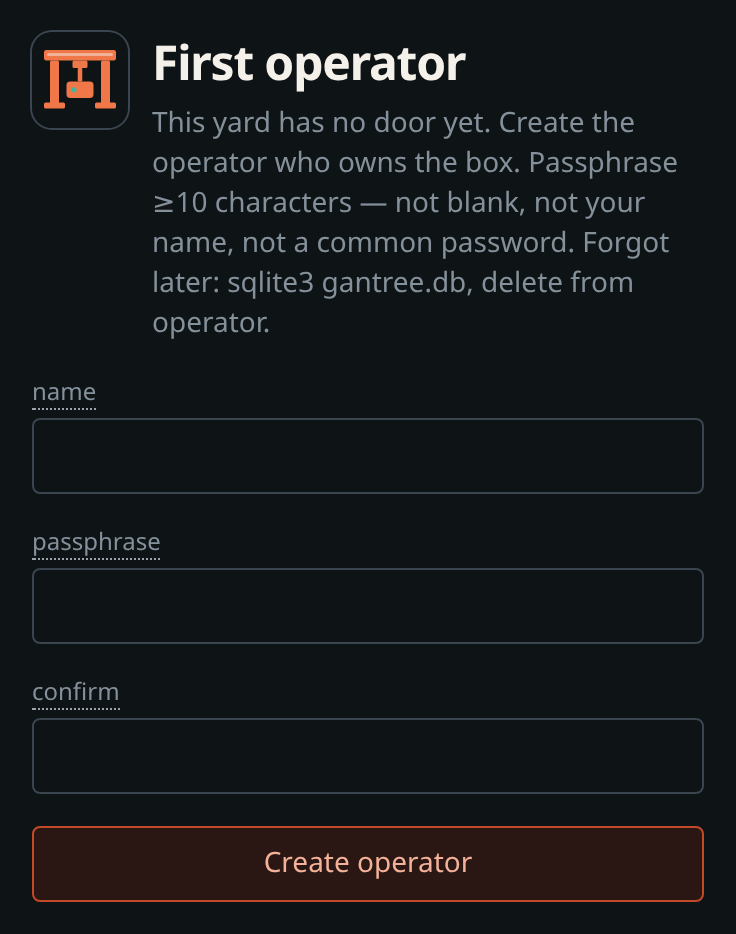
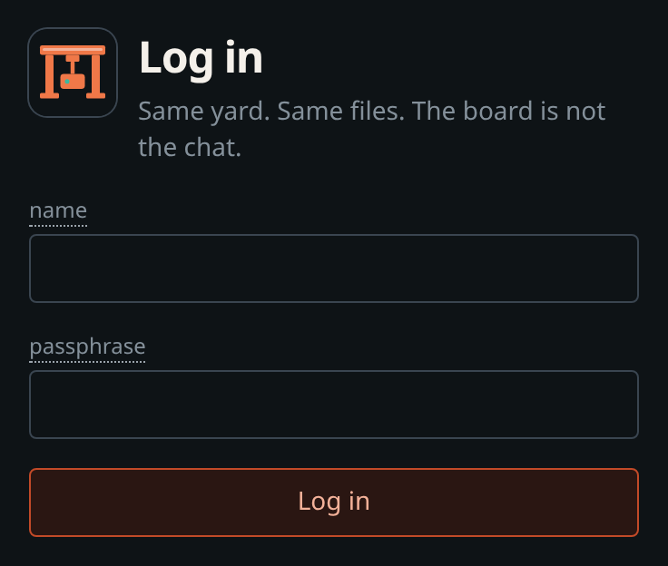
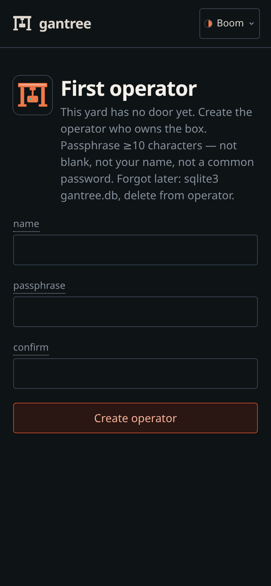
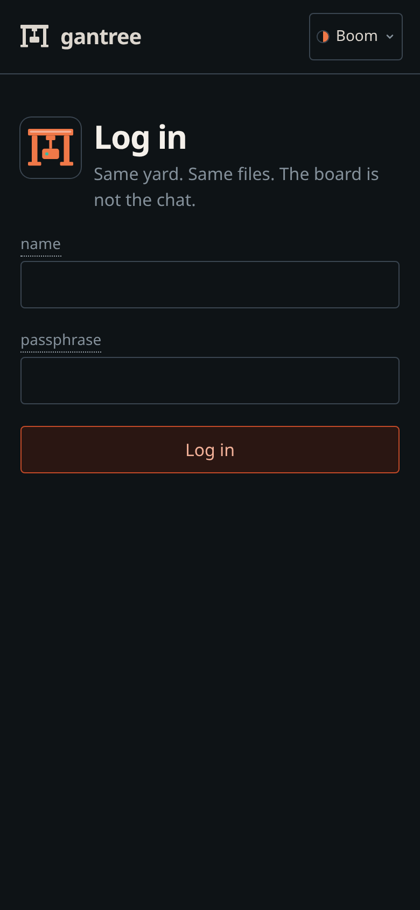
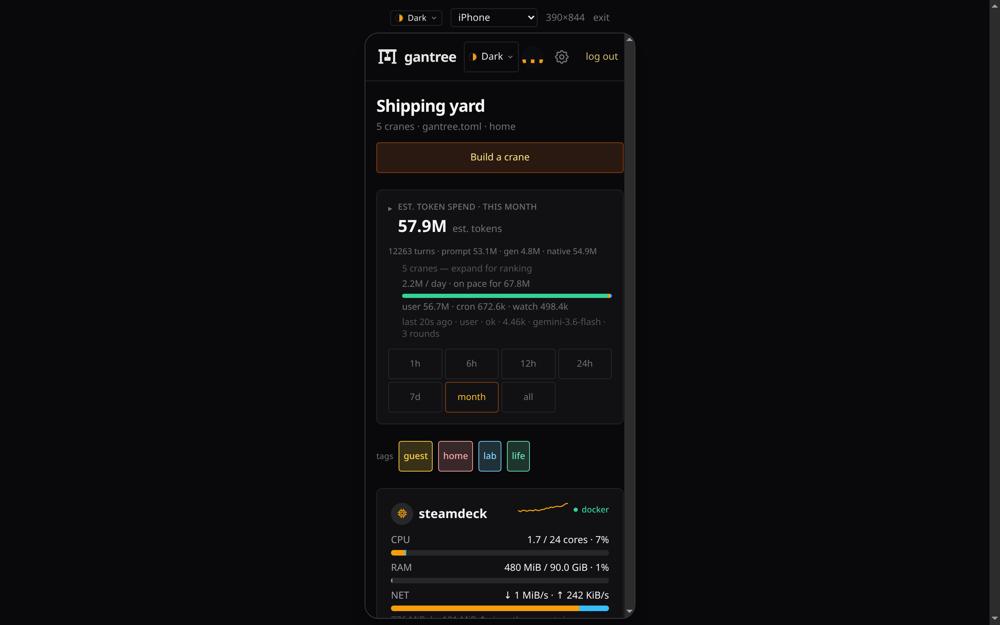
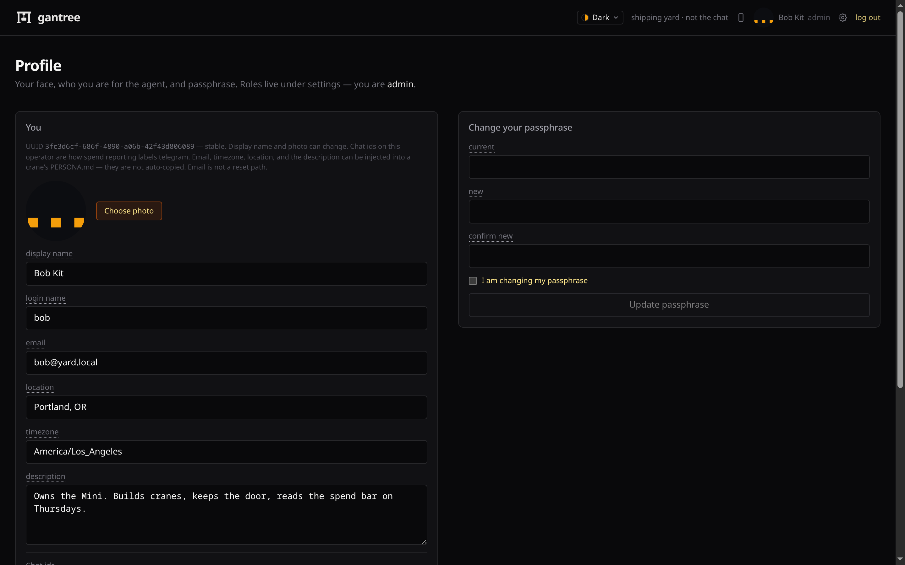
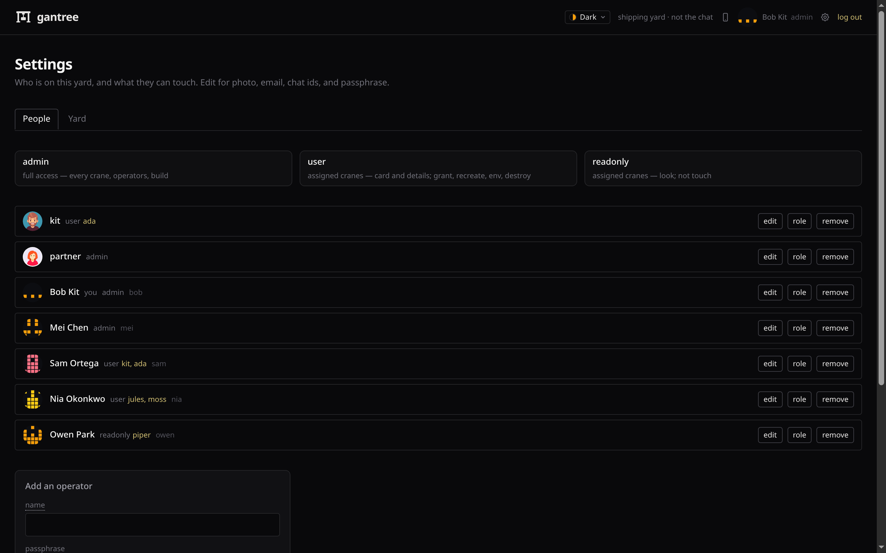

# Operators — login, profile, settings

The board walk is [console.md](console.md). This page is the **people**
on the yard: first boot, your face, and who else can touch a crane.
What the door actually checks: [security.md](security.md).

Chat stays Telegram. Nothing here sits in a chat turn.

---

## First boot

Need **Node 22**. `npm start` (or compose) on the Docker host.

1. Open `http://127.0.0.1:3000` — empty yard is **`/setup`** (one operator,
   always **admin**).
2. After that, **`/login`**. Name + passphrase.
3. Sessions live in yard `gantree.db` — not a crane’s `data/gantry.db`.
   Compose: `var/gantree.db`.

There is no setup token. On an open bind, **whoever POSTs `/setup` first
owns the box.** Create that person before you leave LAN `:80` sitting
there. A second setup is `409 already set up`.

  
  &nbsp;
  
  &nbsp;
  
  &nbsp;
  

Name is `2–32` letters, digits, `.` `_` `-`. Passphrase ≥10 characters,
not blank, not your name, not a common password. Failed logins back off
(8 per name / 15 minutes). Full rules:
[security.md](security.md#passphrases).

Local screenshots / `npm run dev`: `GANTREE_DEV=1` plus operator +
passphrase in `.env` ([.env.example](../.env.example)). Loopback only —
compose `HOST=0.0.0.0` ignores the flag. Unset it to photograph `/login`.
Empty board / no host graphs: `npm run seed` then `GANTREE_SHOT=1`
([console.md](console.md#screenshot-yard-no-daemon)). On a wide screen,
the phone mark in the header is a 390px preview (`?phone=1`) — no
DevTools. Recapture: `node scripts/shot.mjs`.

  

---

## Profile

Click **your name** (or photo) in the header. That is `/profile`. It is
not the cog, and it is not the operator list.

  

Here you can change:

- photo (JPEG / PNG / WebP / GIF; PNG and WebP convert on upload)
- display name (what the header shows)
- login name (what `/login` asks for)
- email (a **label** — not a reset path, not a mailbox)
- description
- chat ids (Telegram numeric, Slack `U…`, Discord snowflake) — stored on
  you; not wired into crane allowlists yet
- passphrase (current + new + confirm, plus the confirm-scary checkbox)

Those fields are what **Inject user** on a crane copies into `PERSONA.md`
**About you** (name, email, timezone, location, notes, chat ids). The file
starts from the ai-gantry seed
(`lib/yard/crane/templates/PERSONA.example.md`). Identity — the agent’s
name — is not overwritten. Save on the crane still writes the file.

The row is a **UUID**. Renaming bob does not mint a new person. You cannot
promote yourself from this page — **role lives under Settings**.

---

## Settings

The **cog** in the header is `/settings`. (`/operators` redirects here.)
Everyone can read the three roles. Only **admin** can add, change access,
or remove.

  

| Role | Access |
| --- | --- |
| **admin** | Every crane. Operators. Build. |
| **user** | Assigned cranes (card, details, grant, recreate, env). Not operators, not other cranes. |
| **readonly** | Assigned cranes — look (card, logs, doctor). Not touch. Not other cranes. |

Setup always creates an admin. **user** and **readonly** need at least
one crane — without any they see an empty board. Tick more than one
when a person covers two bots. Only **admin** sees every crane.
Admin sees logins and logouts on the yard events strip; other roles
do not.
Do not share an admin login the way you would share a read-only
dashboard. A partner who only pastes keys is **user** on their crane(s).
Compose: they hit LAN `:80` or the hostname file you chose, not a published
gantree `:3000`.

Add / remove / change access are **confirm-scary** (checkbox), like a
token push. You cannot delete the last operator, or the last admin, or
demote the last admin.

---

## Stuck?

| Symptom | What to do |
| --- | --- |
| Forgot the passphrase | Stop, delete yard sqlite (`gantree.db`, compose: `var/gantree.db`), start, run `/setup` again. No email reset. |
| `too many attempts, try later` | Wait out the 15-minute window. 8 fails on one name, or 40 across all names, lock that window. |
| `opening the door…` and it never opens | Cookie missing or dead. Hard-refresh `/login`. If the process bounced mid-login, sign in again. |
| Cog does nothing useful / no add form | You are `user` or `readonly`. An admin assigns roles. Photo and passphrase are still on Profile. |
| Logged in as **user** or **readonly**, board is empty | No crane on that row. Admin: Settings → **role** → tick the crane(s). |
| Cannot remove kit / cannot demote bob | Last operator, or last admin. Add another admin first. |
| `/login` never appears in `npm run dev` | `GANTREE_DEV` is on and loopback. Unset it to photograph or test the door. |
| Name exists, passphrase rejected at auto-login | `GANTREE_DEV_PASSPHRASE` must match the hash already in sqlite — or pick a new operator name. |

Bind (loopback vs LAN vs tunnel): [install.md](install.md) ·
[headless.md](headless.md). Hardening: [security.md](security.md).
